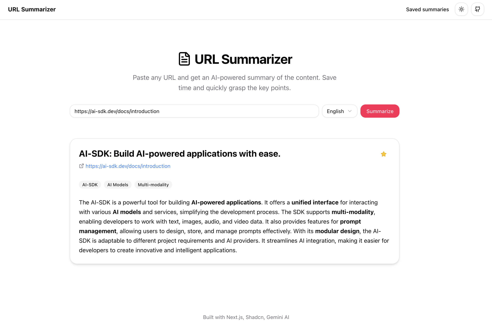
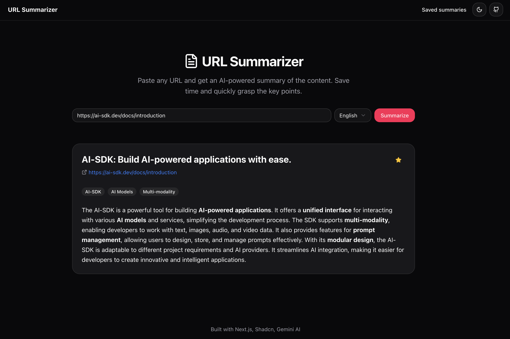
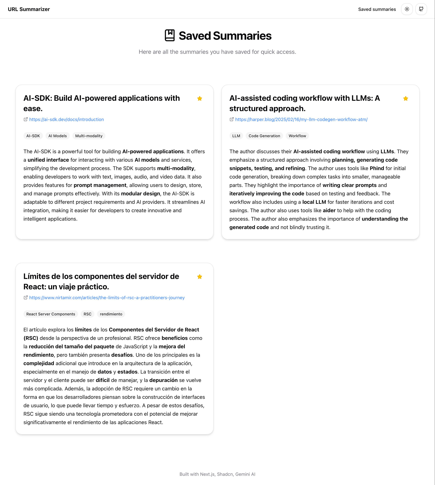

# URL Summarizer 🔍

A modern web application that leverages AI to generate concise summaries of any web content. Simply paste a URL and get an instant, AI-powered summary of the page's key points.


## 🌐 Live Demo

Try it out at: [url-summarizer-one.vercel.app](https://url-summarizer-one.vercel.app)

## ✨ Features

- 🤖 AI-powered content summarization
- 💾 Save summaries for later reference
- 🌓 Dark/Light theme support

## 🛠️ Tech Stack

- [Next.js](https://nextjs.org/) - React framework for production
- [Shadcn/ui](https://ui.shadcn.com/) - Beautiful and customizable UI components
- [Gemini AI](https://deepmind.google/technologies/gemini/) - Google's advanced AI model for text processing
- [Vercel](https://vercel.com) - Deployment and hosting platform

## 🖼️ Screenshots

### Light theme



### Dark theme



### Saved summaries



## 🚀 Getting Started

### Prerequisites

- Node.js (v18 or higher)
- bun (or npm or yarn or pnpm)
- A Gemini AI API key

### Installation

1. Clone the repository
```bash
git clone https://github.com/yourusername/url-summarizer.git
cd url-summarizer
```

2. Install dependencies
```bash
bun install
```

3. Set up environment variables
```bash
cp .env.example .env.local
```
Edit `.env.local` and add your Gemini AI API key:
```
GEMINI_API_KEY=your_api_key_here
```

4. Run the development server
```bash
bun dev
```

5. Open [http://localhost:3000](http://localhost:3000) in your browser

## 📝 Usage

1. Visit the application URL
2. Paste any webpage URL in the input field
3. Select the language of the summary (default is English)
4. Click "Summarize" and wait for the AI to process the content
5. View and save the generated summary
6. Access your saved summaries anytime from the dashboard

## 🤝 Contributing

Contributions are welcome! Please feel free to submit a Pull Request.

## 📄 License

This project is licensed under the MIT License - see the [LICENSE](LICENSE) file for details.

## 🙏 Acknowledgments

- Built with [Next.js](https://nextjs.org/)
- UI components from [Shadcn/ui](https://ui.shadcn.com/)
- AI processing powered by [Gemini AI](https://deepmind.google/technologies/gemini/)
